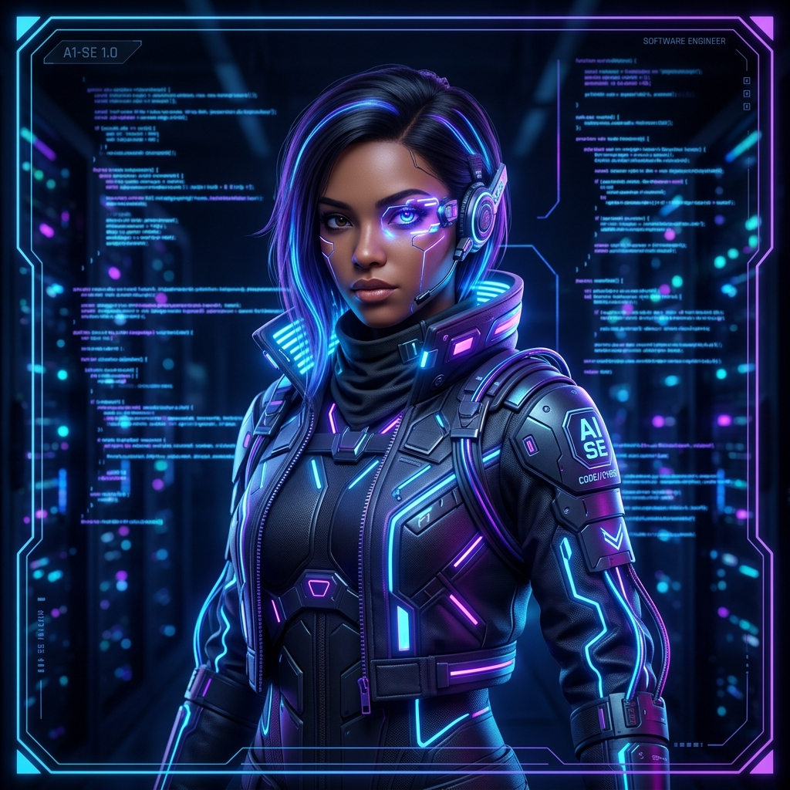
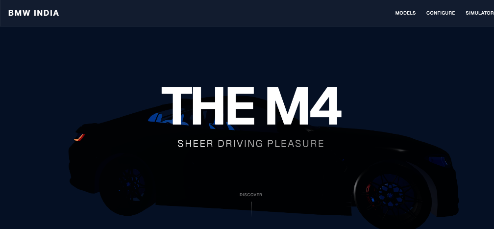
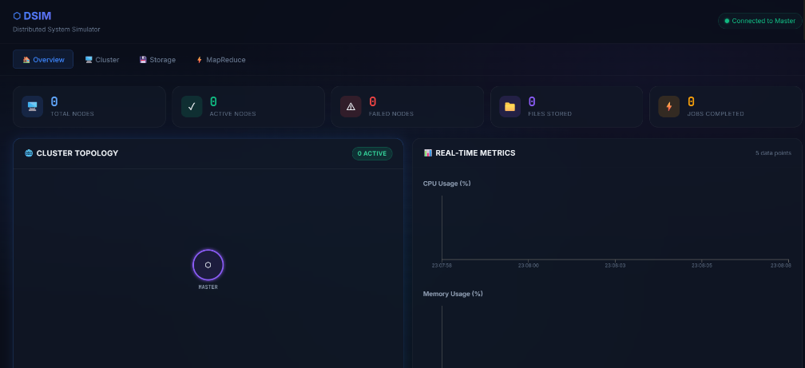
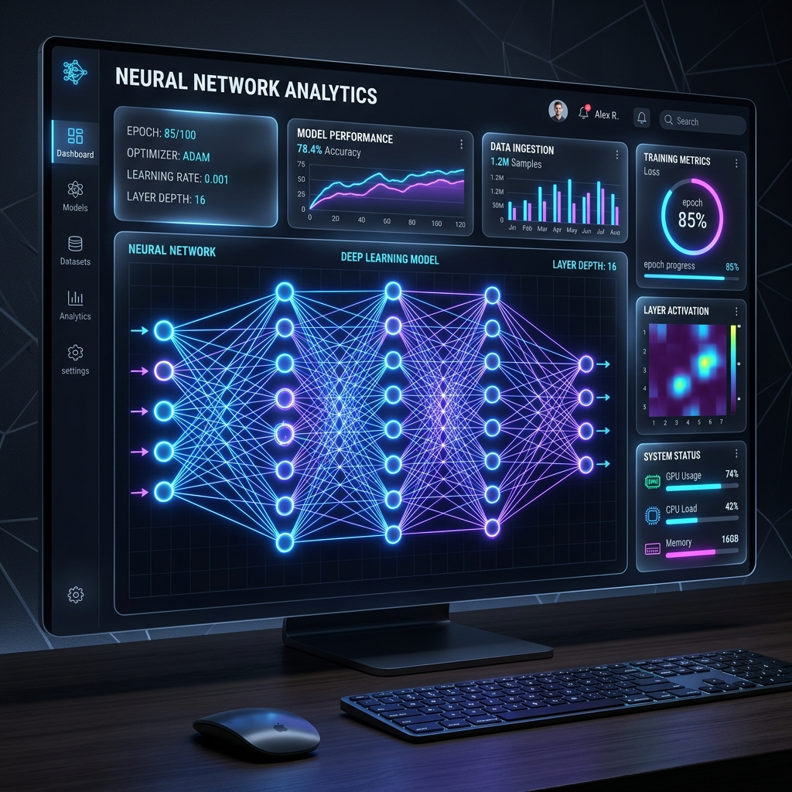
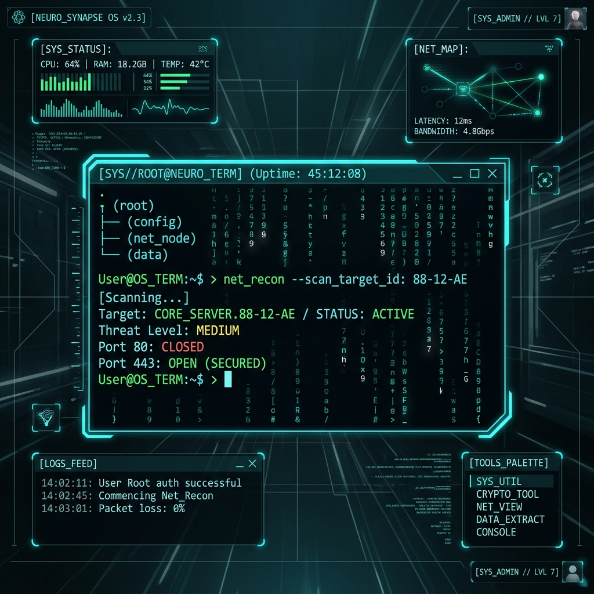
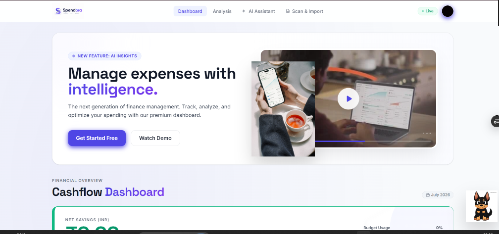
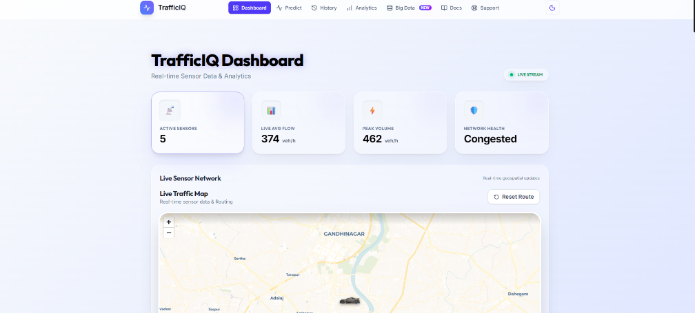

# 🪐 RAJ JOSHI // FULLSTACK & DISTRIBUTED SYSTEMS DEVELOPER

<p align="center">
  <!-- Widescreen Cinematic Header Banner -->
  
</p>

<p align="center">
  <!-- Animated Typing Terminal Banner -->
  
</p>

<!-- Neon Glow Section Divider -->
<p align="center">
  
</p>

════════════════════════════════════════════════════════════════════════════════════════════════════

## 👤 DEVELOPER PROFILE

<table width="100%" border="0" cellpadding="10" cellspacing="0">
  <tr>
    <!-- Avatar and Status -->
    <td width="25%" align="center" valign="top">
      
      <br/><br/>
      <!-- Visitor Counter -->
      
      <br/><br/>
      
    </td>
    <!-- Operating Details -->
    <td width="75%" valign="top">
      <h3>👋 Welcome to My Portfolio</h3>
      <p>I am <b>Raj Joshi</b>, a Computer Science Engineering student at <b>Pandit Deendayal Energy University (PDEU)</b>. I specialize in designing premium fullstack web interfaces, low-latency distributed database systems, and intelligent web integrations.</p>
      <hr border="1" color="#7F5AF0"/>
      <table width="100%" border="0">
        <tr>
          <td><b>📍 LOCATION:</b> Gandhinagar, Gujarat, India</td>
          <td><b>💼 AVAILABILITY:</b> Open to internships &amp; freelance projects</td>
        </tr>
        <tr>
          <td><b>🎓 EDUCATION:</b> B.Tech in CSE @ PDEU</td>
          <td><b>⚡ KEY INTERESTS:</b> Fullstack, Distributed Computing &amp; 3D Web UI</td>
        </tr>
      </table>
      <br/>
      <p align="left">
        <a href="https://github.com/Rajjoshi77"></a>
        <a href="https://github.com/Rajjoshi77"></a>
      </p>
    </td>
  </tr>
</table>

════════════════════════════════════════════════════════════════════════════════════════════════════

## 📟 INTERACTIVE TERMINAL

<details open>
  <summary><b>📟 MAIN PROFILE SHELL (Click to collapse/expand terminal)</b></summary>
  <br/>

```bash
rajjoshi@pdeu:~$ systemctl status distributed-rfs
● distributed-rfs.service - Low-Latency Distributed File System
     Loaded: loaded (/etc/systemd/system/distributed-rfs.service; enabled)
     Active: active (running) since Sat 2026-07-25 15:42:10 IST; 7 hours ago
   Main PID: 7777 (rfs-core)
      Tasks: 32 (limit: 8192)
     Memory: 256M
     CGroup: /system.slice/distributed-rfs.service
             └─7777 /usr/bin/node rfs-server.js --partition-blocks --network-sockets

rajjoshi@pdeu:~$ cat profile.json
{
  "name": "Raj Joshi",
  "university": "Pandit Deendayal Energy University (PDEU)",
  "major": "Computer Science and Engineering",
  "focus": {
    "languages": ["TypeScript", "JavaScript", "Python", "HTML/CSS", "SQL", "C++"],
    "technologies": ["React", "Express.js", "Node.js", "MongoDB", "Three.js", "WebSockets"]
  }
}

rajjoshi@pdeu:~$ wakatime --query today
Today's Logged Code Cycles: 8 hrs 15 mins
[██████████████████████████████████████████░░░░░░░░░░░░] 78% Efficiency
- BMW-3D Showcase:      3 hrs 40 mins (TypeScript / Three.js)
- RFS Computations:      2 hrs 15 mins (Node.js / Distributed logic)
- EMS Dashboard UI:     2 hrs 20 mins (React / MongoDB)

rajjoshi@pdeu:~$ _
```
</details>

════════════════════════════════════════════════════════════════════════════════════════════════════

## 🛠️ SKILLS & TECHNOLOGIES

<table width="100%" border="0" cellpadding="5" cellspacing="5">
  <tr>
    <!-- Frontend -->
    <td width="33%" valign="top" style="border: 1px solid #7F5AF0; border-radius: 8px; background: #0D1117;">
      <h3 align="center">🎨 FRONTEND</h3>
      <p align="center">
        <br/>
        <br/>
        <br/>
        <br/>
        
      </p>
    </td>
    <!-- Backend -->
    <td width="33%" valign="top" style="border: 1px solid #7F5AF0; border-radius: 8px; background: #0D1117;">
      <h3 align="center">⚙️ BACKEND</h3>
      <p align="center">
        <br/>
        <br/>
        <br/>
        <br/>
        
      </p>
    </td>
    <!-- Databases -->
    <td width="33%" valign="top" style="border: 1px solid #7F5AF0; border-radius: 8px; background: #0D1117;">
      <h3 align="center">💾 DATABASE &amp; CLOUD</h3>
      <p align="center">
        <br/>
        <br/>
        <br/>
        <br/>
        
      </p>
    </td>
  </tr>
</table>

<!-- Neon Glow Section Divider -->
<p align="center">
  
</p>

════════════════════════════════════════════════════════════════════════════════════════════════════

## 💻 PROJECT SHOWCASE

High-performance applications and core repositories built from scratch.

### 🚗 BMW-3D — Luxury Automotive Showcase
<p align="center">
  
</p>

A next-generation BMW-inspired luxury web experience. Built with custom 3D element rendering, smooth CSS keyframes, and highly interactive presentation grids focused on delivering an immersive product showcase.

**🛠️ Tech Stack & Deployment:**
<p align="left">
  
  
  
</p>

[➡️ Live Website Demo](https://bmw-3d-two.vercel.app) &nbsp;│&nbsp; [💾 Repository Source](https://github.com/Rajjoshi77/BMW-3D)

---

### 📡 RFS — Distributed File System
<p align="center">
  
</p>

A functional distributed storage node model enabling remote computation distributions, file chunk partition systems, and data synchronization triggers over custom Socket layers.

**🛠️ Tech Stack & Deployment:**
<p align="left">
  
  
  
  
</p>

[➡️ Live File System Demo](https://rfs-two.vercel.app) &nbsp;│&nbsp; [💾 Repository Source](https://github.com/Rajjoshi77/RFS)

---

### 🤖 TALENTRA — AI Interviewer Platform
<p align="center">
  
</p>

An intelligent web application that automates candidate interview coordinate schedules, evaluation reporting, and custom scoring algorithms using artificial intelligence API layers.

**🛠️ Tech Stack & Deployment:**
<p align="left">
  
  
  
</p>

[➡️ Live Deployment Demo](https://talentra-backend.vercel.app) &nbsp;│&nbsp; [💾 Repository Source](https://github.com/Rajjoshi77/Talentra)

---

### 👥 EMS — Employee Management System
<p align="center">
  
</p>

A web-based registry and administrative portal to catalog profiles, structure department coordinate filters, manage credentials authentication, and trigger full CRUD database commands inside React.

**🛠️ Tech Stack & Deployment:**
<p align="left">
  
  
  
  
</p>

[💾 Repository Source](https://github.com/Rajjoshi77/EMS)

════════════════════════════════════════════════════════════════════════════════════════════════════

## 🛠️ UTILITIES & TOOLKITS

A collection of utilities and trackers built to solve daily challenges.

<table width="100%">
  <tr>
    <td width="50%" valign="top">
      
      <h3>📈 SPENDOR — Expense Tracker</h3>
      <p>A responsive, visual expense management card to monitor financial transactions, balance sheets, and savings budgets.</p>
      <p><b>🛠️ Tech Stack:</b> React, TailwindCSS, Chart.js</p>
      <p>
        <a href="https://spendor-financetracer.vercel.app"><b>[ ▶️ Open Website ]</b></a> &nbsp;│&nbsp; <a href="https://github.com/Rajjoshi77/Expense_Tracker"><b>[ 💾 Source Code ]</b></a>
      </p>
    </td>
    <td width="50%" valign="top">
      
      <h3>🚦 SMART TRAFFIC — Traffic Flow Coordinator</h3>
      <p>An interactive traffic signal simulation designed to optimize signal cycles and coordinate lane pathing overlays.</p>
      <p><b>🛠️ Tech Stack:</b> JavaScript, Canvas, Pathfinding Logic</p>
      <p>
        <a href="https://smart-traffic-management-hazel.vercel.app"><b>[ ▶️ Open Website ]</b></a> &nbsp;│&nbsp; <a href="https://github.com/Rajjoshi77/Smart-Traffic-Management"><b>[ 💾 Source Code ]</b></a>
      </p>
    </td>
  </tr>
</table>

<!-- Neon Glow Section Divider -->
<p align="center">
  
</p>

════════════════════════════════════════════════════════════════════════════════════════════════════

## 📊 GITHUB METRICS

Direct integration with our repository activity logs, tracking cycle efficiency, lang distribution, and contributions.

<table width="100%">
  <!-- Stats and Langs -->
  <tr>
    <td align="center" width="50%" valign="top">
      
    </td>
    <td align="center" width="50%" valign="top">
      
    </td>
  </tr>
  <!-- Streak and Contribution Layout -->
  <tr>
    <td align="center" colspan="2" valign="top">
      
    </td>
  </tr>
  <!-- Contribution Grid Animation (Snake) -->
  <tr>
    <td align="center" colspan="2" valign="top">
      <h4>👾 GRID ACTIVITY (SNAKE TIMELINE)</h4>
      
    </td>
  </tr>
</table>

════════════════════════════════════════════════════════════════════════════════════════════════════

## 📅 EDUCATION & TIMELINE

The chronological grid of our active operations.

<table width="100%" border="0">
  <tr>
    <td align="right" valign="top" width="20%"><b>2023 — PRESENT</b></td>
    <td align="center" valign="top" width="5%">🎓</td>
    <td valign="top" width="75%">
      <b>B.Tech in Computer Science and Engineering @ PDEU</b>
      <p>Engaging in core academic computation vectors including Database Management, Object-Oriented Analysis, Distributed Computation models, and Visual Web Engineering layouts.</p>
    </td>
  </tr>
  <tr><td colspan="3"><hr border="1" color="rgba(127, 90, 240, 0.1)"/></td></tr>
  <tr>
    <td align="right" valign="top"><b>2024 — PRESENT</b></td>
    <td align="center" valign="top">💻</td>
    <td valign="top">
      <b>Open Source Collaborator &amp; Maintainer</b>
      <p>Publishing responsive web showcases (BMW-3D), database management registers (EMS), and smart trackers (Spendor, Smart Traffic Coordinator) on the GitHub network.</p>
    </td>
  </tr>
</table>

════════════════════════════════════════════════════════════════════════════════════════════════════

## 🎵 CODING SOUNDTRACK

Sountracks driving coding loops and algorithm flows.

<table width="100%">
  <tr>
    <td width="100" align="center">
      
    </td>
    <td valign="top">
      <h4>📻 NOW SYNCHRONIZING: Lofi Study Mainframe</h4>
      <p><i>Song: Focus Cycles — Artist: Raj Joshi Sessions</i></p>
      
    </td>
  </tr>
</table>

════════════════════════════════════════════════════════════════════════════════════════════════════

## 📬 CONNECT WITH ME

Establish connection links or browse portfolio nodes.

<p align="left">
  <!-- GitHub -->
  <a href="https://github.com/Rajjoshi77" target="_blank">
    
  </a>
  <!-- LinkedIn -->
  <a href="https://linkedin.com/in/Rajjoshi77" target="_blank">
    
  </a>
  <!-- Portfolio -->
  <a href="https://portfolio-raj-sage.vercel.app" target="_blank">
    
  </a>
  <!-- Email -->
  <a href="mailto:rajj94380@gmail.com">
    
  </a>
</p>

```
Mail Terminal Port: rajj94380@gmail.com
Status: Secure Connection Available
```

════════════════════════════════════════════════════════════════════════════════════════════════════

<p align="center">
  <sub>MADE WITH LOVE BY RAJ JOSHI // 2026</sub>
</p>

<p align="center">
  <!-- Neon Glowing Footer Wave Divider -->
  
</p>
