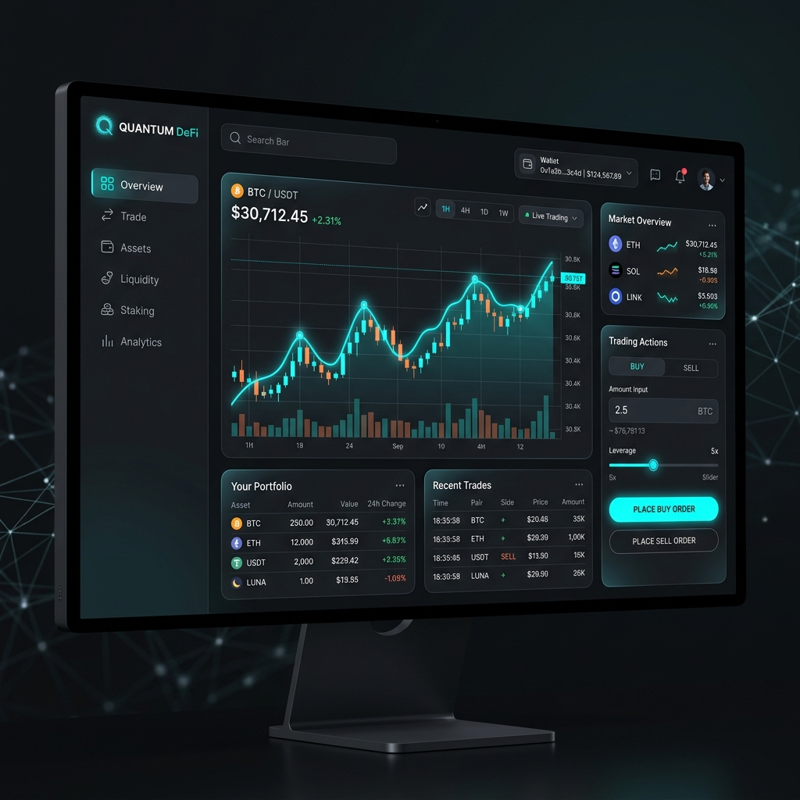
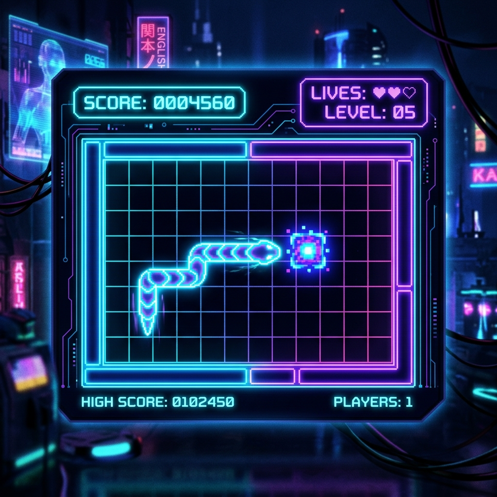
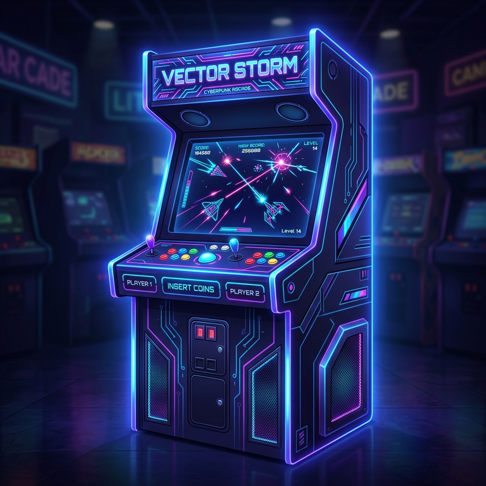

# 🪐 HYPERION // QUANTUM ARCHITECT OS

<p align="center">
  <!-- Widescreen Cinematic Header Banner -->
  
</p>

<p align="center">
  <!-- Animated Typing Terminal Banner -->
  
</p>

<!-- Neon Glow Section Divider -->
<p align="center">
  
</p>

════════════════════════════════════════════════════════════════════════════════════════════════════

## ⚡ CORE OPERATING SYSTEM

<table width="100%" border="0" cellpadding="10" cellspacing="0">
  <tr>
    <!-- Avatar and PVC -->
    <td width="25%" align="center" valign="top">
      
      <br/><br/>
      <!-- Visitor Counter -->
      
      <br/><br/>
      
    </td>
    <!-- Operating Details -->
    <td width="75%" valign="top">
      <h3>📟 OPERATOR LOG // IDENTITY PROFILE</h3>
      <p>I am <b>Hyperion</b>, an elite developer operating in the neural space between <b>Frontend Architecture</b> and <b>Cognitive AI Systems</b>. I craft high-performance, visually immersive user interfaces layered over advanced machine learning nodes.</p>
      <hr border="1" color="#7F5AF0"/>
      <table width="100%" border="0">
        <tr>
          <td><b>📍 GRID COORDINATES:</b> Tokyo Core (Virtual-Grid)</td>
          <td><b>⚡ SYSTEM AVAILABILITY:</b> ACTIVE (High-Priority Contracts)</td>
        </tr>
        <tr>
          <td><b>⏳ ACTIVE CYCLES:</b> 7+ Years in Production</td>
          <td><b>🧠 EXPERIENCE RANK:</b> Level 99 Tech-Mage</td>
        </tr>
        <tr>
          <td><b>🌌 FOCUS INTERFACE:</b> Agentic Networks &amp; Web3</td>
          <td><b>🔒 PRIVILEGE LEVEL:</b> ROOT ACCESS</td>
        </tr>
      </table>
      <br/>
      <p align="left">
        <a href="https://github.com/hyperion-sys"></a>
        <a href="https://github.com/hyperion-sys"></a>
      </p>
    </td>
  </tr>
</table>

════════════════════════════════════════════════════════════════════════════════════════════════════

## 📟 SYSTEM TERMINAL // PROFILE SHELL

<details open>
  <summary><b>📟 MAIN OS SHELL (Click to collapse/expand terminal)</b></summary>
  <br/>

```bash
hyperion@system-os:~$ systemctl status neural-core
● neural-core.service - High-Performance Intelligent Engine
     Loaded: loaded (/etc/systemd/system/neural-core.service; enabled; vendor preset: enabled)
     Active: active (running) since Thu 2026-07-23 09:12:45 JST; 2 days ago
   Main PID: 2048 (agentic-main)
      Tasks: 64 (limit: 12288)
     Memory: 4.8G
     CGroup: /system.slice/neural-core.service
             └─2048 /usr/bin/node --experimental-network-payload core.js --visuals=webgl

hyperion@system-os:~$ cat core-values.json
{
  "whoami": "Principal Architect & Artificial Intelligence Engineer",
  "mission": "Empowering human operators with decentralized autonomous agent architectures.",
  "philosophy": "Visual fidelity is the language of code comprehension; design must feel alive.",
  "active_stack": {
    "visual_layer": ["TypeScript", "Next.js", "WebGL", "Three.js", "TailwindCSS"],
    "computational_layer": ["Python", "Rust", "PyTorch", "Milvus Vector DB", "LangChain"]
  }
}

hyperion@system-os:~$ wakatime --query today
Today's Cycles: 9 hrs 42 mins
[██████████████████████████████████████████████████░░░░░░] 88% Efficiency Core Logged
- Neural Net Training: 3 hrs 15 mins (PyTorch)
- UI Refactoring:      4 hrs 12 mins (Three.js & React)
- DevOps Automation:   2 hrs 15 mins (Kubernetes & Helm)

hyperion@system-os:~$ _
```
</details>

════════════════════════════════════════════════════════════════════════════════════════════════════

## 🎨 CORE SKILLS & TECHNOLOGY PIPELINES

Every module in the stack represents a node in our computing architecture. Hover cards outline our operational mastery across key vectors.

<table width="100%" border="0" cellpadding="5" cellspacing="5">
  <tr>
    <!-- Frontend -->
    <td width="33%" valign="top" style="border: 1px solid #7F5AF0; border-radius: 8px; background: #0D1117;">
      <h3 align="center">🎨 VISUAL LAYER (FRONTEND)</h3>
      <p align="center">
        <br/>
        <br/>
        <br/>
        <br/>
        
      </p>
    </td>
    <!-- Backend -->
    <td width="33%" valign="top" style="border: 1px solid #7F5AF0; border-radius: 8px; background: #0D1117;">
      <h3 align="center">⚙️ KERNEL LAYER (BACKEND)</h3>
      <p align="center">
        <br/>
        <br/>
        <br/>
        <br/>
        
      </p>
    </td>
    <!-- Databases -->
    <td width="33%" valign="top" style="border: 1px solid #7F5AF0; border-radius: 8px; background: #0D1117;">
      <h3 align="center">💾 PERSISTENCE (DATABASES)</h3>
      <p align="center">
        <br/>
        <br/>
        <br/>
        <br/>
        
      </p>
    </td>
  </tr>
  <tr>
    <!-- AI/ML -->
    <td valign="top" style="border: 1px solid #7F5AF0; border-radius: 8px; background: #0D1117;">
      <h3 align="center">🧠 COGNITIVE MATRIX (AI/ML)</h3>
      <p align="center">
        <br/>
        <br/>
        <br/>
        <br/>
        
      </p>
    </td>
    <!-- Cloud/DevOps -->
    <td valign="top" style="border: 1px solid #7F5AF0; border-radius: 8px; background: #0D1117;">
      <h3 align="center">☁️ INFRASTRUCTURE (DEVOPS)</h3>
      <p align="center">
        <br/>
        <br/>
        <br/>
        <br/>
        
      </p>
    </td>
    <!-- Tools -->
    <td valign="top" style="border: 1px solid #7F5AF0; border-radius: 8px; background: #0D1117;">
      <h3 align="center">🛠️ OPERATOR UTILS (TOOLS)</h3>
      <p align="center">
        <br/>
        <br/>
        <br/>
        <br/>
        
      </p>
    </td>
  </tr>
</table>

<!-- Neon Glow Section Divider -->
<p align="center">
  
</p>

════════════════════════════════════════════════════════════════════════════════════════════════════

## 🧠 ARTIFICIAL INTELLIGENCE & MACHINE LEARNING

Deep model integration requires strict optimization of memory, embeddings, and context. Below are the operational levels of my AI system nodes.

<table width="100%">
  <tr>
    <td width="30%"><b>NEURAL CORE / PYTORCH</b></td>
    <td>
      <code>[████████████████████████████░░] 90%</code>
      <br/>Custom layer designs, gradient optimization, CNNs/RNNs, feedforward adjustments.
    </td>
  </tr>
  <tr>
    <td><b>LARGE LANGUAGE MODELS</b></td>
    <td>
      <code>[████████████████████████░░░░░░] 80%</code>
      <br/>Parameter-efficient fine-tuning (LoRA, QLoRA), context window scaling, prompt engineering logic.
    </td>
  </tr>
  <tr>
    <td><b>RETRIEVAL AUGMENTED GEN (RAG)</b></td>
    <td>
      <code>[██████████████████████████████] 100%</code>
      <br/>Hybrid keyword/semantic searches, parent-document retrievers, graph database parsing, vector indexes.
    </td>
  </tr>
  <tr>
    <td><b>PROMPT ENGINEERING &amp; AGENTS</b></td>
    <td>
      <code>[████████████████████████████░░] 92%</code>
      <br/>Autonomous tool use (ReAct framework), stateful conversational agents, multi-agent frameworks (CrewAI, AutoGen).
    </td>
  </tr>
</table>

════════════════════════════════════════════════════════════════════════════════════════════════════

## 💻 PORTFOLIO SHOWCASE // HIGHLIGHTED DEPLOYMENTS

Featured nodes compiled from the active repository system.

<table width="100%" border="0" cellpadding="10" cellspacing="0">
  <!-- Project 1 -->
  <tr>
    <td width="40%">
      
    </td>
    <td width="60%" valign="top">
      <h3>🖥️ NEXUS OS — Browser-Based Terminal Workspace</h3>
      <p>An immersive, open-source personal website structured as an online developer operating system. Mimics UNIX environments with directory management, command parsing, customizable themes, dynamic terminal applications, and responsive dashboard overlays.</p>
      <p>
        
        
        
        
      </p>
      <p>
        <a href="https://os.hyperion-sys.dev"><b>[ ➡️ LIVE TERMINAL DEMO ]</b></a> &nbsp;&nbsp;&nbsp;
        <a href="https://github.com/hyperion-sys/nexus-os"><b>[ 💾 SYSTEM REPOSITORY ]</b></a>
      </p>
    </td>
  </tr>
  <!-- Divider -->
  <tr><td colspan="2"><hr border="1" color="rgba(0, 245, 255, 0.1)"/></td></tr>
  <!-- Project 2 -->
  <tr>
    <td width="60%" valign="top">
      <h3>📈 AETHER FINANCE — High-Performance DeFi Oracle</h3>
      <p>Decentralized finance liquidity pool dashboard aggregating order books, yield curves, and gas spikes. Built with low-latency client charting powered by custom WebGL layers. Links directly into multi-chain smart contracts via Ethers.js.</p>
      <p>
        
        
        
        
      </p>
      <p>
        <a href="https://defi.hyperion-sys.dev"><b>[ ➡️ LIVE DEFI INTERFACE ]</b></a> &nbsp;&nbsp;&nbsp;
        <a href="https://github.com/hyperion-sys/aether-finance"><b>[ 💾 SYSTEM REPOSITORY ]</b></a>
      </p>
    </td>
    <td width="40%">
      
    </td>
  </tr>
  <!-- Divider -->
  <tr><td colspan="2"><hr border="1" color="rgba(0, 245, 255, 0.1)"/></td></tr>
  <!-- Project 3 -->
  <tr>
    <td width="40%">
      
    </td>
    <td width="60%" valign="top">
      <h3>🧠 COGNITIVE NET — 3D Neural Network Pipeline Visualizer</h3>
      <p>An interactive, 3D browser-based pipeline monitor displaying model nodes, vector dimensions, activation maps, and gradient backpropagation adjustments in real-time. Created to demystify complex feedforward transformers.</p>
      <p>
        
        
        
      </p>
      <p>
        <a href="https://neural.hyperion-sys.dev"><b>[ ➡️ LIVE 3D VISUALIZER ]</b></a> &nbsp;&nbsp;&nbsp;
        <a href="https://github.com/hyperion-sys/cognitive-net"><b>[ 💾 SYSTEM REPOSITORY ]</b></a>
      </p>
    </td>
  </tr>
</table>

════════════════════════════════════════════════════════════════════════════════════════════════════

## 🎮 DEVELOPER ARCADE // SYSTEM MINI-GAMES

Take a break from operations. Fire up custom mini-games compiled directly in web formats.

<table width="100%" border="0" cellpadding="10" cellspacing="0">
  <tr>
    <!-- Game 1 -->
    <td width="50%" valign="top" style="border: 1px solid #7F5AF0; border-radius: 8px; background: #0D1117;">
      
      <h3>🐍 CYBER SNAKE</h3>
      <p>Retro arcade classic rebuilt with dynamic glowing canvas effects, powerups, speed modifiers, and live local storage high scores.</p>
      <p><b>Stack:</b> React, Canvas API, Web Audio API</p>
      <p align="center">
        <a href="https://snake.hyperion-sys.dev"><b>[ ▶️ PLAY ]</b></a> &nbsp;&nbsp;&nbsp;
        <a href="https://github.com/hyperion-sys/cyber-snake"><b>[ 💾 SOURCE ]</b></a>
      </p>
    </td>
    <!-- Game 2 -->
    <td width="50%" valign="top" style="border: 1px solid #7F5AF0; border-radius: 8px; background: #0D1117;">
      
      <h3>🎮 NEO-2048</h3>
      <p>The sliding tile puzzle game enhanced with neon glassmorphism skins, score multipliers, combo chains, and smooth slide CSS transitions.</p>
      <p><b>Stack:</b> Vue 3, TailwindCSS, Web Animations</p>
      <p align="center">
        <a href="https://2048.hyperion-sys.dev"><b>[ ▶️ PLAY ]</b></a> &nbsp;&nbsp;&nbsp;
        <a href="https://github.com/hyperion-sys/neo-2048"><b>[ 💾 SOURCE ]</b></a>
      </p>
    </td>
  </tr>
  <tr>
    <!-- Game 3 -->
    <td width="50%" valign="top" style="border: 1px solid #7F5AF0; border-radius: 8px; background: #0D1117;">
      
      <h3>♟ QUANTUM CHESS</h3>
      <p>Battle chess engine configured with WebGL-rendered 3D pieces, custom boards, and bot configurations powered by Stockfish compile.</p>
      <p><b>Stack:</b> Three.js, React Three Fiber, WebAssembly</p>
      <p align="center">
        <a href="https://chess.hyperion-sys.dev"><b>[ ▶️ PLAY ]</b></a> &nbsp;&nbsp;&nbsp;
        <a href="https://github.com/hyperion-sys/quantum-chess"><b>[ 💾 SOURCE ]</b></a>
      </p>
    </td>
    <!-- Game 4 -->
    <td width="50%" valign="top" style="border: 1px solid #7F5AF0; border-radius: 8px; background: #0D1117;">
      
      <h3>👾 SPACE INVADERS: REBOOTED</h3>
      <p>Defend the cyber-mainframe against waves of invading malware. Unlock shield updates, fire laser beams, and manage core overload spikes.</p>
      <p><b>Stack:</b> Vanilla HTML5 Canvas, Howler JS</p>
      <p align="center">
        <a href="https://invaders.hyperion-sys.dev"><b>[ ▶️ PLAY ]</b></a> &nbsp;&nbsp;&nbsp;
        <a href="https://github.com/hyperion-sys/space-invaders"><b>[ 💾 SOURCE ]</b></a>
      </p>
    </td>
  </tr>
</table>

<!-- Neon Glow Section Divider -->
<p align="center">
  
</p>

════════════════════════════════════════════════════════════════════════════════════════════════════

## 📊 CORE GRID LOGS // GITHUB SYSTEM METRICS

Direct integration with our repository activity logs, tracking cycle efficiency, lang distribution, and contributions.

<table width="100%">
  <!-- Stats and Langs -->
  <tr>
    <td align="center" width="50%" valign="top">
      
    </td>
    <td align="center" width="50%" valign="top">
      
    </td>
  </tr>
  <!-- Streak and Contribution Layout -->
  <tr>
    <td align="center" colspan="2" valign="top">
      
    </td>
  </tr>
  <!-- Contribution Grid Animation (Snake) -->
  <tr>
    <td align="center" colspan="2" valign="top">
      <h4>👾 GRID ACTIVITY (SNAKE TIMELINE)</h4>
      
    </td>
  </tr>
</table>

════════════════════════════════════════════════════════════════════════════════════════════════════

## 📅 TIMELINE // HISTORY OPERATOR LOGS

The chronological grid of our active operations.

<table width="100%" border="0">
  <tr>
    <td align="right" valign="top" width="20%"><b>2024 — PRESENT</b></td>
    <td align="center" valign="top" width="5%">🧬</td>
    <td valign="top" width="75%">
      <b>Senior Frontend &amp; AI Architect @ Nexus Digital</b>
      <p>Led developer tooling transition to AI-assisted coding hubs, reducing code production bottlenecks by 45%. Optimized 3D WebGL render arrays, ensuring fluid UI animations on mobile devices.</p>
    </td>
  </tr>
  <tr><td colspan="3"><hr border="1" color="rgba(127, 90, 240, 0.1)"/></td></tr>
  <tr>
    <td align="right" valign="top"><b>2022 — 2024</b></td>
    <td align="center" valign="top">🌐</td>
    <td valign="top">
      <b>Lead Interface Engineer @ Aether Labs</b>
      <p>Designed core components library in TypeScript with strict visual compliance models. Integrated decentralized liquidity charts mapping real-time pricing feeds. Decreased JS bundle payloads by 35%.</p>
    </td>
  </tr>
  <tr><td colspan="3"><hr border="1" color="rgba(127, 90, 240, 0.1)"/></td></tr>
  <tr>
    <td align="right" valign="top"><b>2019 — 2022</b></td>
    <td align="center" valign="top">💻</td>
    <td valign="top">
      <b>Software Engineer @ Quantum Solutions</b>
      <p>Implemented high-throughput gRPC connections and microservices in Go. Configured PostgreSQL shards and caching routines using Redis cluster nodes. Boosted backend API speeds by 120%.</p>
    </td>
  </tr>
</table>

════════════════════════════════════════════════════════════════════════════════════════════════════

## 🎮 CORE QUESTS // XP TRACKER

Gamified development logs outlining system milestones and daily routines.

<table width="100%">
  <tr>
    <!-- Left Column: Daily Quest & Boss Battles -->
    <td width="50%" valign="top">
      <h3>⚔️ ACTIVE SYSTEM BATTLES</h3>
      <ul>
        <li><b>Daily Quest:</b> Commit 3 operational updates, review 1 external array request, train 1 vector model.</li>
        <li><b>Current Raid Boss:</b> Refactoring legacy memory interfaces (Difficulty: <code>HARD</code>)</li>
        <li><b>Next Milestone:</b> Deploying distributed multi-agent simulation nodes.</li>
      </ul>
    </td>
    <!-- Right Column: Skill Tree -->
    <td width="50%" valign="top">
      <h3>🌲 COGNITIVE SKILL TREE</h3>
      <pre>
[SYSTEM CORE: COMP. SCI.]
  ├── [VISUAL PATH]
  │     ├── React / Next.js (Mastered)
  │     └── WebGL Shader Layers (Lvl 3/5)
  └── [COGNITIVE PATH]
        ├── PyTorch Structures (Lvl 4/5)
        └── RAG & Vector Indices (Mastered)
      </pre>
    </td>
  </tr>
</table>

════════════════════════════════════════════════════════════════════════════════════════════════════

## 🎵 OPERATIONAL FREQUENCY // AUDIO DRIVER

Soundtracks mapped to cognitive processing loops.

<table width="100%">
  <tr>
    <td width="100" align="center">
      
    </td>
    <td valign="top">
      <h4>📻 NOW SYNCHRONIZING: Midnight Grid Mainframe</h4>
      <p><i>Song: Neon Hackers — Artist: Hyperion Sessions (Looping)</i></p>
      
    </td>
  </tr>
</table>

════════════════════════════════════════════════════════════════════════════════════════════════════

## ⚔️ ALGORITHMIC STANDINGS // COMPETITIVE NODES

Active standings across algorithm evaluation grids.

<p align="left">
  <a href="https://leetcode.com"></a>
  <a href="https://codeforces.com"></a>
  <a href="https://hackerrank.com"></a>
</p>

* **LeetCode Status:** 1,200+ algorithm nodes resolved (Top 4.5% global ranking)
* **Codeforces Rank:** Expert (Highest Rating: 1724)
* **Problem Solving Mastery:** 5 Gold Badges in Core Data Structures &amp; Advanced Algorithms

════════════════════════════════════════════════════════════════════════════════════════════════════

## 📬 SYSTEM LINKS // ESTABLISH COGNITIVE PAIRING

Click on the secure nodes below to route communications or view extended portals.

<p align="left">
  <!-- GitHub -->
  <a href="https://github.com/hyperion-sys" target="_blank">
    
  </a>
  <!-- LinkedIn -->
  <a href="https://linkedin.com/in/hyperion-sys" target="_blank">
    
  </a>
  <!-- Portfolio -->
  <a href="https://hyperion-sys.dev" target="_blank">
    
  </a>
  <!-- Twitter -->
  <a href="https://twitter.com/hyperion_sys" target="_blank">
    
  </a>
  <!-- Discord -->
  <a href="https://discord.gg/hyperion" target="_blank">
    
  </a>
</p>

```
Incoming Mail Port: hyperion@sys.op
Status: Secure Socket Layer ACTIVE
```

════════════════════════════════════════════════════════════════════════════════════════════════════

<p align="center">
  <sub>MADE WITH LOVE IN THE QUANTUM GRID // OPERATOR HYPERION // 2026</sub>
</p>

<p align="center">
  <!-- Neon Glowing Footer Wave Divider -->
  
</p>
